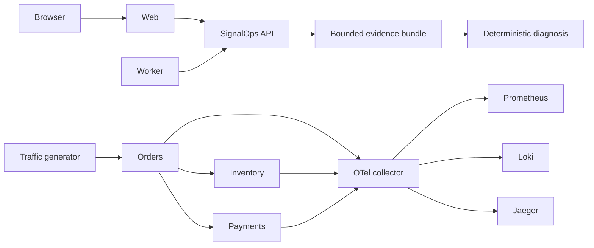

# Architecture overview

SignalOps separates operational state from telemetry and keeps diagnosis read-only.

The four scenario types are the only accepted fault controls. Each fault has a bounded TTL and is cleared by the target service without relying on a browser connection. Diagnosis claims must cite supplied evidence IDs, and recommendations must be classified `read_only`.
